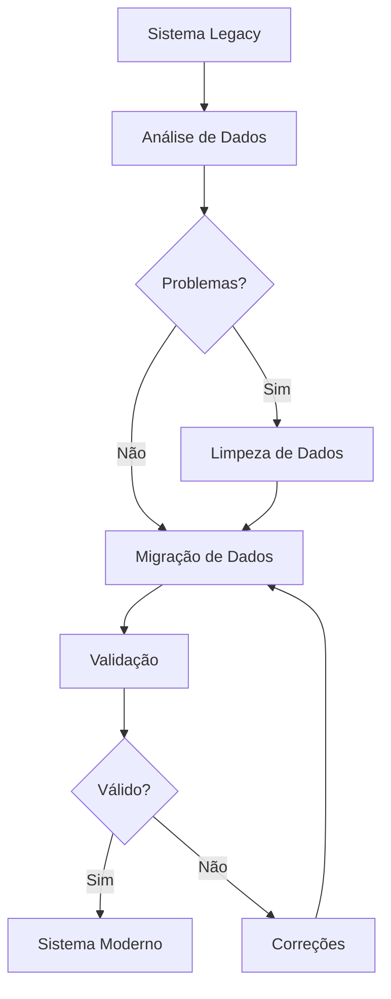

# 📋 Documentação e Scripts Criados - FastrackGPS

Este documento resume toda a documentação e scripts criados para o sistema FastrackGPS.

## 📁 Estrutura de Arquivos Criados

```
fastrackgpsweb/
├── README.md                           # 📖 Documentação principal do sistema
├── MIGRATION_GUIDE.md                  # 🚀 Guia completo de migração  
├── DOCUMENTAÇÃO_CRIADA.md             # 📋 Este arquivo (resumo)
│
├── shared-modules/
│   ├── scripts/
│   │   ├── migration-manager.php       # 🎯 Gerenciador principal de migração
│   │   └── migration/
│   │       ├── analyze-legacy-data.php # 🔍 Análise dos dados legacy
│   │       ├── clean-legacy-data.php   # 🧹 Limpeza dos dados legacy  
│   │       ├── migrate-data.php        # 📦 Migração principal dos dados
│   │       └── validate-migration.php  # ✅ Validação da migração
│   │
│   └── database/
│       ├── schema-modern.sql           # 🏗️  Schema do sistema moderno
│       └── seed-data.sql              # 🌱 Dados iniciais/demonstração
```

## 📖 Documentos Principais

### 1. README.md
**Arquivo:** `/README.md`  
**Descrição:** Documentação completa do sistema FastrackGPS

**Conteúdo:**
- ✅ Visão geral da arquitetura (Legacy + Moderno + Compartilhado)
- ✅ Instruções de instalação e configuração
- ✅ Comandos de desenvolvimento
- ✅ Estrutura do banco de dados
- ✅ Funcionalidades principais
- ✅ Guias de deploy e produção
- ✅ Troubleshooting e suporte

### 2. MIGRATION_GUIDE.md  
**Arquivo:** `/MIGRATION_GUIDE.md`  
**Descrição:** Guia detalhado para migração Legacy → Moderno

**Conteúdo:**
- ✅ Processo passo a passo de migração
- ✅ Pré-requisitos e preparação
- ✅ Scripts de migração explicados
- ✅ Estratégias de rollback
- ✅ Monitoramento e validação
- ✅ Solução de problemas comuns
- ✅ Métricas de sucesso

## 🛠️ Scripts de Migração

### 1. Migration Manager (Gerenciador Principal)
**Arquivo:** `shared-modules/scripts/migration-manager.php`  
**Função:** Script centralizado para gerenciar toda a migração

**Comandos:**
```bash
# Migração completa
php migration-manager.php full

# Passo específico  
php migration-manager.php step 1

# Status da migração
php migration-manager.php status

# Rollback
php migration-manager.php rollback

# Ajuda
php migration-manager.php help
```

### 2. Análise dos Dados Legacy
**Arquivo:** `shared-modules/scripts/migration/analyze-legacy-data.php`  
**Função:** Analisa dados do sistema legacy antes da migração

**Funcionalidades:**
- ✅ Conta registros em todas as tabelas
- ✅ Identifica dados inconsistentes
- ✅ Detecta referências órfãs
- ✅ Verifica emails/IMEIs duplicados
- ✅ Gera relatório JSON detalhado

**Uso:**
```bash
php analyze-legacy-data.php
```

### 3. Limpeza dos Dados Legacy  
**Arquivo:** `shared-modules/scripts/migration/clean-legacy-data.php`  
**Função:** Limpa e corrige problemas nos dados legacy

**Funcionalidades:**
- ✅ Remove usuários com dados inválidos
- ✅ Corrige emails duplicados
- ✅ Gera IMEIs para veículos sem IMEI
- ✅ Remove posições com coordenadas inválidas
- ✅ Elimina registros órfãos
- ✅ Modo dry-run para testes

**Uso:**
```bash
# Teste (sem alterações)
php clean-legacy-data.php --dry-run

# Execução real
php clean-legacy-data.php
```

### 4. Migração Principal dos Dados
**Arquivo:** `shared-modules/scripts/migration/migrate-data.php`  
**Função:** Migra dados do sistema legacy para o moderno

**Funcionalidades:**
- ✅ Backup automático antes da migração
- ✅ Criação das tabelas modernas
- ✅ Migração de usuários com UUIDs
- ✅ Migração de veículos e relacionamentos
- ✅ Migração de posições GPS em lotes
- ✅ Migração de cercas virtuais, alertas e comandos
- ✅ Mapeamento de IDs legacy → UUIDs
- ✅ Modo dry-run para testes

**Uso:**
```bash
# Teste (sem alterações)
php migrate-data.php --dry-run

# Execução real  
php migrate-data.php
```

### 5. Validação da Migração
**Arquivo:** `shared-modules/scripts/migration/validate-migration.php`  
**Função:** Valida integridade dos dados após migração

**Funcionalidades:**
- ✅ Verifica estrutura das tabelas
- ✅ Compara contagens legacy vs moderno
- ✅ Valida integridade referencial
- ✅ Verifica UUIDs únicos e válidos
- ✅ Testa relacionamentos entre tabelas
- ✅ Verifica qualidade dos dados
- ✅ Gera relatório de validação

**Uso:**
```bash
php validate-migration.php
```

## 🗄️ Scripts de Banco de Dados

### 1. Schema do Sistema Moderno
**Arquivo:** `shared-modules/database/schema-modern.sql`  
**Função:** Cria estrutura completa do banco moderno

**Tabelas criadas:**
- ✅ `modern_users` - Usuários com UUIDs
- ✅ `modern_vehicles` - Veículos/equipamentos  
- ✅ `modern_positions` - Posições GPS (particionadas)
- ✅ `modern_geofences` - Cercas virtuais
- ✅ `modern_geofence_vehicles` - Associações cerca-veículo
- ✅ `modern_alerts` - Sistema de alertas
- ✅ `modern_commands` - Comandos para dispositivos
- ✅ `modern_reports` - Relatórios gerados
- ✅ `modern_audit_logs` - Logs de auditoria (particionados)

**Recursos:**
- ✅ Views otimizadas (`view_latest_positions`, `view_user_statistics`)
- ✅ Índices para performance
- ✅ Triggers de auditoria
- ✅ Particionamento de tabelas grandes
- ✅ Chaves estrangeiras e constraints

### 2. Dados Iniciais/Demonstração
**Arquivo:** `shared-modules/database/seed-data.sql`  
**Função:** Popula banco com dados de demonstração

**Dados incluídos:**
- ✅ 3 usuários (admin, demo, teste)
- ✅ 3 veículos (carro, caminhão, motocicleta)
- ✅ Posições GPS de exemplo
- ✅ 2 cercas virtuais (circular e poligonal)
- ✅ Alertas de demonstração
- ✅ Comandos de exemplo
- ✅ Logs de auditoria iniciais

## 🔄 Fluxo de Migração

### Processo Completo



### Comandos em Sequência

```bash
# 1. Análise inicial
php migration-manager.php step 1

# 2. Limpeza (se necessária)  
php migration-manager.php step 2

# 3. Migração dos dados
php migration-manager.php step 3

# 4. Validação
php migration-manager.php step 4

# OU tudo de uma vez:
php migration-manager.php full
```

## 📊 Recursos e Funcionalidades

### Sistema de Logs
- ✅ Logs detalhados em JSON
- ✅ Timestamps e rastreabilidade
- ✅ Relatórios de progresso
- ✅ Logs de erro e debug

### Segurança
- ✅ Backups automáticos
- ✅ Modo dry-run para testes
- ✅ Validação de integridade
- ✅ Rollback completo

### Performance  
- ✅ Migração em lotes para tabelas grandes
- ✅ Índices otimizados
- ✅ Particionamento de tabelas
- ✅ Conexões eficientes ao banco

### Usabilidade
- ✅ Interface CLI amigável
- ✅ Progresso visual com emojis
- ✅ Confirmações de segurança
- ✅ Ajuda contextual

## 🎯 Como Usar

### Primeira Execução

1. **Preparação:**
   ```bash
   cd shared-modules/scripts/
   chmod +x migration-manager.php
   ```

2. **Verificar status:**
   ```bash
   ./migration-manager.php status
   ```

3. **Executar migração completa:**
   ```bash
   ./migration-manager.php full
   ```

### Execução por Etapas

```bash
# Passo 1: Análise
./migration-manager.php step 1

# Passo 2: Limpeza (teste)
./migration-manager.php step 2 --dry-run

# Passo 2: Limpeza (real)
./migration-manager.php step 2

# Passo 3: Migração (teste)
./migration-manager.php step 3 --dry-run

# Passo 3: Migração (real)
./migration-manager.php step 3

# Passo 4: Validação
./migration-manager.php step 4
```

### Em Caso de Problemas

```bash
# Rollback completo
./migration-manager.php rollback

# Verificar logs
tail -f ../logs/migration-*.json

# Status atual
./migration-manager.php status
```

## 📋 Checklist de Implementação

### Pré-Migração
- [ ] Backup completo do sistema legacy
- [ ] Verificar pré-requisitos (PHP 8.1+, MySQL 8.0+)
- [ ] Configurar arquivo `database.php`
- [ ] Executar análise dos dados (`step 1`)
- [ ] Resolver problemas identificados

### Durante a Migração  
- [ ] Executar limpeza se necessária (`step 2`)
- [ ] Fazer migração dos dados (`step 3`)
- [ ] Validar integridade (`step 4`)
- [ ] Monitorar logs e performance
- [ ] Testar funcionalidades básicas

### Pós-Migração
- [ ] Configurar sistema moderno
- [ ] Treinar usuários na nova interface  
- [ ] Estabelecer monitoramento contínuo
- [ ] Documentar customizações
- [ ] Planejar descontinuação do legacy

## 🎉 Resumo Final

### O que foi criado:

✅ **Documentação completa** (README.md, MIGRATION_GUIDE.md)  
✅ **5 scripts PHP** para migração automatizada  
✅ **2 arquivos SQL** para banco de dados moderno  
✅ **Gerenciador CLI** para facilitar execução  
✅ **Sistema de logs** e auditoria  
✅ **Validação completa** da migração  
✅ **Procedimentos de rollback**  
✅ **Dados de demonstração**  

### Benefícios alcançados:

🚀 **Migração Automatizada** - Scripts fazem todo o trabalho pesado  
🛡️  **Segurança Total** - Backups, validações e rollback  
📊 **Transparência** - Logs detalhados e relatórios  
⚡ **Performance** - Migração otimizada em lotes  
🎯 **Simplicidade** - Comandos fáceis de usar  
📖 **Documentação** - Tudo documentado e explicado  

---

**🎯 Todo o sistema está pronto para migração!**

Execute: `php shared-modules/scripts/migration-manager.php full` para começar.

---

**FastrackGPS Development Team**  
*Versão: 2.0.0 | Data: Janeiro 2025*