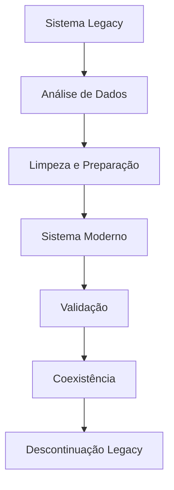

# 🚀 Guia Completo de Migração - FastrackGPS

Este guia documenta o processo completo de migração do sistema legacy para o sistema moderno do FastrackGPS.

## 📋 Índice

- [Visão Geral](#visão-geral)
- [Pré-requisitos](#pré-requisitos)
- [Arquitetura da Migração](#arquitetura-da-migração)
- [Processo Passo a Passo](#processo-passo-a-passo)
- [Scripts de Migração](#scripts-de-migração)
- [Validação e Testes](#validação-e-testes)
- [Rollback](#rollback)
- [Monitoramento](#monitoramento)
- [Solução de Problemas](#solução-de-problemas)

## 🎯 Visão Geral

### Objetivos da Migração

- **Modernização**: Migrar do PHP legacy para arquitetura moderna
- **Performance**: Melhorar velocidade e escalabilidade
- **Segurança**: Implementar melhores práticas de segurança
- **Manutenibilidade**: Facilitar futuras atualizações e melhorias
- **Compatibilidade**: Manter funcionalidade existente durante transição

### Estratégia de Migração



## 📋 Pré-requisitos

### Requisitos Técnicos

#### Sistema Legacy
- PHP 5.6+ (compatível com funções mysql_*)
- MySQL 5.6+
- Apache/Nginx com mod_rewrite
- Pelo menos 2GB RAM
- 10GB espaço em disco

#### Sistema Moderno
- PHP 8.1+
- MySQL 8.0+ (recomendado)
- Composer 2.0+
- Extensões PHP: pdo, json, curl, mbstring, xml
- Pelo menos 4GB RAM
- 20GB espaço em disco

### Requisitos de Backup
- Backup completo do banco de dados
- Backup dos arquivos do sistema
- Ponto de restauração documentado

## 🏗️ Arquitetura da Migração

### Sistemas em Coexistência

Durante a migração, ambos os sistemas funcionarão simultaneamente:

```
┌─────────────────┐    ┌─────────────────┐
│   Sistema       │    │   Sistema       │
│   Legacy        │◄──►│   Moderno       │
│                 │    │                 │
│ - PHP clássico  │    │ - PHP 8.1+      │
│ - MySQL direto  │    │ - PSR-4         │
│ - Framesets     │    │ - Clean Arch    │
│ - Sem testes    │    │ - Testes        │
└─────────────────┘    └─────────────────┘
         │                       │
         └───────────────────────┘
                    │
         ┌─────────────────┐
         │  Banco MySQL    │
         │                 │
         │ - Tabelas       │
         │   Legacy        │
         │ - Tabelas       │
         │   Modernas      │
         │ - Shared Data   │
         └─────────────────┘
```

### Estrutura de Dados

#### Sistema Legacy
```sql
usuarios (id, nome, email, senha, ativo, tipo)
veiculos (id, id_usuario, nome, imei, placa, modelo, cor)
posicoes (id, id_veiculo, latitude, longitude, velocidade, data_hora)
```

#### Sistema Moderno
```sql
modern_users (id, legacy_id, name, email, password_hash, is_active, is_admin)
modern_vehicles (id, legacy_id, user_id, name, imei, plate, model, brand)
modern_positions (id, legacy_id, vehicle_id, latitude, longitude, speed, recorded_at)
```

## 🚀 Processo Passo a Passo

### Fase 1: Preparação (1-2 dias)

#### 1.1 Análise dos Dados Legacy
```bash
cd shared-modules/scripts/migration/
php analyze-legacy-data.php
```

**O que faz:**
- Conta registros em todas as tabelas
- Identifica dados inconsistentes
- Verifica referências órfãs
- Gera relatório detalhado

**Saída esperada:**
```
📊 RESUMO GERAL:
   👥 Usuários: 150 (145 ativos, 5 inativos)
   🚗 Veículos: 420 (média de 2.8 por usuário)
   📍 Posições: 1,250,000 (45,000 nos últimos 30 dias)
   🚨 Alertas: 3,200
   🔒 Cercas: 89
   📡 Comandos: 1,150
```

#### 1.2 Limpeza dos Dados
```bash
# Executar em modo teste primeiro
php clean-legacy-data.php --dry-run

# Aplicar limpeza após verificação
php clean-legacy-data.php
```

**Correções aplicadas:**
- Remove usuários com dados obrigatórios em branco
- Corrige emails e IMEIs duplicados
- Remove posições com coordenadas inválidas
- Elimina registros órfãos

### Fase 2: Migração de Dados (1-3 dias)

#### 2.1 Executar Migração
```bash
# Executar em modo teste
php migrate-data.php --dry-run

# Executar migração real
php migrate-data.php
```

**Processo de migração:**
1. **Backup automático** do banco atual
2. **Criação das tabelas modernas**
3. **Migração em ordem**:
   - Usuários (👥)
   - Veículos (🚗)
   - Cercas Virtuais (🔒)
   - Posições GPS (📍) - em lotes
   - Alertas (🚨)
   - Comandos (📡)

#### 2.2 Mapeamento de IDs
O sistema mantém mapeamento entre IDs legacy e UUIDs modernos:

```json
{
  "users": {
    "1": "550e8400-e29b-41d4-a716-446655440000",
    "2": "550e8400-e29b-41d4-a716-446655440001"
  },
  "vehicles": {
    "1": "660e8400-e29b-41d4-a716-446655440000",
    "2": "660e8400-e29b-41d4-a716-446655440001"
  }
}
```

### Fase 3: Validação (1 dia)

#### 3.1 Validação Automática
```bash
php validate-migration.php
```

**Verificações realizadas:**
- ✅ Estrutura das tabelas
- ✅ Contagens de registros
- ✅ Integridade referencial
- ✅ Qualidade dos dados
- ✅ UUIDs únicos
- ✅ Relacionamentos

#### 3.2 Relatório de Validação
```
📋 RELATÓRIO DE VALIDAÇÃO DA MIGRAÇÃO
============================================================

🏗️  ESTRUTURA DAS TABELAS:
   ✅ modern_users: 150 registros
   ✅ modern_vehicles: 420 registros
   ✅ modern_positions: 1,250,000 registros

📊 COMPARAÇÃO DE CONTAGENS:
   ✅ users: Legacy(150) -> Moderno(150)
   ✅ vehicles: Legacy(420) -> Moderno(420)
   ✅ positions: Legacy(1,250,000) -> Moderno(1,250,000)

✅ NENHUM PROBLEMA ENCONTRADO
🎉 Migração validada com sucesso!
```

### Fase 4: Coexistência (1-4 semanas)

Durante este período, ambos sistemas funcionam:

#### 4.1 Sincronização Bidirecional
- Novos dados no legacy são migrados automaticamente
- Alterações no moderno podem ser refletidas no legacy
- Monitoramento contínuo da consistência

#### 4.2 Testes de Usuário
- Usuários testam sistema moderno
- Feedback é coletado e implementado
- Treinamento da equipe

## 🛠️ Scripts de Migração

### Script Principal: migrate-data.php

```php
<?php
// Uso: php migrate-data.php [--dry-run]

// Funcionalidades:
// - Backup automático
// - Criação de tabelas modernas  
// - Migração de dados com mapeamento de IDs
// - Tratamento de erros e rollback
// - Relatório detalhado
```

### Scripts de Apoio

#### 1. analyze-legacy-data.php
- **Propósito**: Análise completa dos dados legacy
- **Saída**: Relatório JSON + console
- **Tempo**: 5-15 minutos

#### 2. clean-legacy-data.php
- **Propósito**: Limpeza e correção de dados
- **Opções**: `--dry-run` para teste
- **Tempo**: 10-30 minutos

#### 3. validate-migration.php
- **Propósito**: Validação pós-migração
- **Verificações**: 15+ tipos de validação
- **Tempo**: 5-10 minutos

## ✅ Validação e Testes

### Testes Automatizados

#### 1. Testes de Integridade
```sql
-- Verificar referências órfãs
SELECT COUNT(*) FROM modern_vehicles v 
LEFT JOIN modern_users u ON v.user_id = u.id 
WHERE u.id IS NULL;

-- Verificar UUIDs válidos
SELECT COUNT(*) FROM modern_users 
WHERE id NOT REGEXP '^[0-9a-f-]{36}$';
```

#### 2. Testes de Performance
```bash
# Consulta de posições recentes
time mysql -e "SELECT * FROM modern_positions 
WHERE recorded_at > NOW() - INTERVAL 1 HOUR 
ORDER BY recorded_at DESC LIMIT 1000"

# Consulta de veículos por usuário
time mysql -e "SELECT u.name, COUNT(v.id) 
FROM modern_users u 
LEFT JOIN modern_vehicles v ON u.id = v.user_id 
GROUP BY u.id"
```

### Testes Manuais

#### 1. Interface do Usuário
- [ ] Login funciona
- [ ] Lista de veículos carrega
- [ ] Mapa exibe posições
- [ ] Alertas aparecem
- [ ] Comandos podem ser enviados

#### 2. APIs
- [ ] Endpoints REST respondem
- [ ] Autenticação funciona
- [ ] Dados retornados são corretos
- [ ] Performance adequada

## 🔄 Rollback

### Estratégia de Rollback

Em caso de problemas críticos:

#### 1. Rollback Rápido (< 5 minutos)
```bash
# Desativar sistema moderno
sudo systemctl stop apache2
# ou redirecionamento DNS/proxy
```

#### 2. Rollback de Dados (10-30 minutos)
```bash
# Restaurar backup do banco
mysql fastrackgps < backup-before-migration-YYYY-MM-DD.sql

# Restaurar arquivos
rsync -av backup-files/ /var/www/fastrackgps/
```

#### 3. Validação do Rollback
```bash
# Verificar funcionalidade básica
curl http://localhost/fastrackgps/login.php
curl http://localhost/fastrackgps/ajax/listar_veiculos.php
```

### Critérios para Rollback

Execute rollback imediatamente se:
- [ ] Sistema legacy parar de funcionar
- [ ] Perda de dados críticos detectada
- [ ] Performance inaceitável (> 5x mais lento)
- [ ] Funcionalidade essencial quebrada
- [ ] Segurança comprometida

## 📊 Monitoramento

### Métricas de Monitoramento

#### 1. Durante a Migração
```bash
# Monitor de progresso
tail -f shared-modules/logs/migration-progress.log

# Monitor de performance do banco
mysqladmin processlist -u root -p

# Monitor de espaço em disco
df -h
```

#### 2. Pós-Migração
```bash
# Monitor de logs de erro
tail -f modern-fastrackgps/storage/logs/app.log

# Monitor de queries lentas
tail -f /var/log/mysql/slow-query.log

# Monitor de uso de CPU/memória
htop
```

### Dashboard de Monitoramento

```sql
-- Consultas de monitoramento em tempo real

-- Usuários ativos últimas 24h
SELECT COUNT(*) as active_users 
FROM modern_users 
WHERE last_login_at > NOW() - INTERVAL 24 HOUR;

-- Posições recebidas última hora
SELECT COUNT(*) as recent_positions 
FROM modern_positions 
WHERE received_at > NOW() - INTERVAL 1 HOUR;

-- Alertas não lidos
SELECT COUNT(*) as unread_alerts 
FROM modern_alerts 
WHERE is_read = FALSE;

-- Comandos pendentes
SELECT COUNT(*) as pending_commands 
FROM modern_commands 
WHERE status = 'pending';
```

## 🚨 Solução de Problemas

### Problemas Comuns

#### 1. Erro de Conexão com Banco
**Sintoma**: `PDO Connection failed`
**Solução**:
```bash
# Verificar serviço MySQL
sudo systemctl status mysql

# Testar conexão
mysql -u username -p -h localhost -e "SELECT 1"

# Verificar configuração
cat shared-modules/config/database.php
```

#### 2. Timeout na Migração de Posições
**Sintoma**: Script para após várias horas
**Solução**:
```bash
# Aumentar timeout PHP
echo "max_execution_time = 0" >> /etc/php/8.1/cli/php.ini

# Migrar em lotes menores
php migrate-data.php --batch-size=5000
```

#### 3. IDs Duplicados
**Sintoma**: Erro de chave duplicada
**Solução**:
```bash
# Limpar dados duplicados
php clean-legacy-data.php

# Re-executar migração
php migrate-data.php --force-clean
```

#### 4. Referências Órfãs
**Sintoma**: Constraint violation errors
**Solução**:
```sql
-- Encontrar registros órfãos
SELECT * FROM veiculos v 
LEFT JOIN usuarios u ON v.id_usuario = u.id 
WHERE u.id IS NULL;

-- Corrigir ou remover
DELETE FROM veiculos WHERE id_usuario NOT IN (SELECT id FROM usuarios);
```

### Logs e Debugging

#### Localizações dos Logs
```
shared-modules/logs/
├── legacy-analysis-YYYY-MM-DD-HH-MM-SS.json
├── cleaning-log-YYYY-MM-DD-HH-MM-SS.json
├── migration-report-YYYY-MM-DD-HH-MM-SS.json
├── validation-report-YYYY-MM-DD-HH-MM-SS.json
└── id-mappings.json
```

#### Aumentar Verbosidade
```bash
# Debug completo da migração
php migrate-data.php --debug --verbose

# Logs detalhados do sistema moderno
tail -f modern-fastrackgps/storage/logs/app.log
```

## 📈 Métricas de Sucesso

### KPIs da Migração

- **✅ Integridade**: 100% dos dados migrados sem perda
- **✅ Performance**: Tempo de resposta < 2x do sistema legacy
- **✅ Disponibilidade**: Uptime > 99.5% durante migração
- **✅ Funcionalidade**: 100% das features críticas funcionando
- **✅ Usuário**: < 5% de reclamações sobre nova interface

### Relatório Final

Após conclusão da migração:

```
🎉 MIGRAÇÃO CONCLUÍDA COM SUCESSO!

📊 ESTATÍSTICAS FINAIS:
   👥 Usuários migrados: 150/150 (100%)
   🚗 Veículos migrados: 420/420 (100%) 
   📍 Posições migradas: 1,250,000/1,250,000 (100%)
   🚨 Alertas migrados: 3,200/3,200 (100%)
   🔒 Cercas migradas: 89/89 (100%)
   📡 Comandos migrados: 1,150/1,150 (100%)

⏱️  TEMPO TOTAL: 3 dias e 14 horas
🎯 ZERO PERDA DE DADOS
🚀 SISTEMA MODERNO OPERACIONAL
```

## 📚 Próximos Passos

### Pós-Migração Imediata (1 semana)
- [ ] Monitorar logs e performance
- [ ] Coletar feedback dos usuários
- [ ] Corrigir bugs menores identificados
- [ ] Otimizar queries lentas
- [ ] Treinar equipe de suporte

### Médio Prazo (1 mês)
- [ ] Implementar features modernas
- [ ] Melhorar interface do usuário
- [ ] Adicionar testes automatizados
- [ ] Configurar CI/CD
- [ ] Documentar APIs

### Longo Prazo (3 meses)
- [ ] Descontinuar sistema legacy
- [ ] Migrar para microserviços
- [ ] Implementar cache distribuído
- [ ] Adicionar machine learning
- [ ] Desenvolver app mobile

---

## 🤝 Suporte

Para suporte durante a migração:
- 📧 Email: suporte@fastrackgps.com
- 📱 WhatsApp: +55 11 99999-9999
- 💬 Slack: #migracao-fastrackgps
- 📖 Documentação: `/shared-modules/docs/`

---

**FastrackGPS Migration Team**  
*Versão: 2.0.0 | Data: 2025*